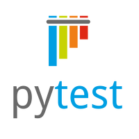
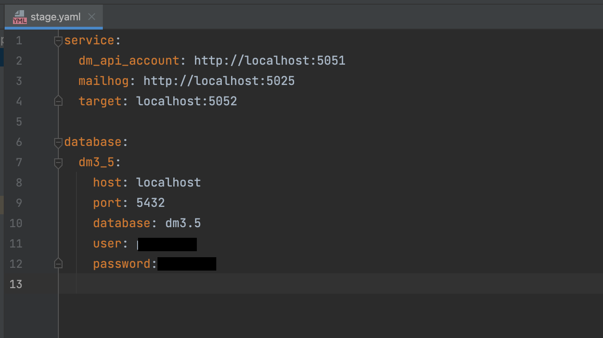
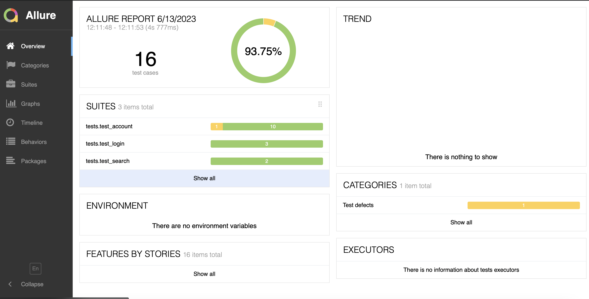
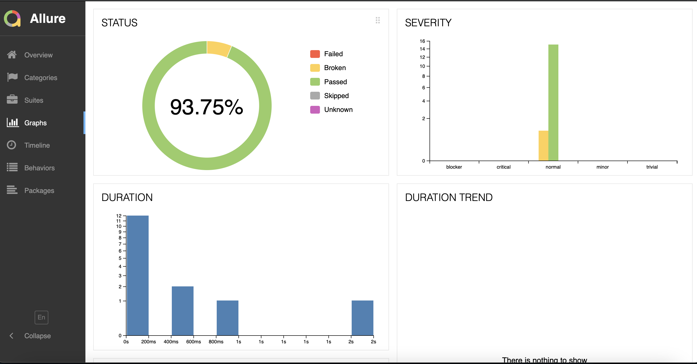
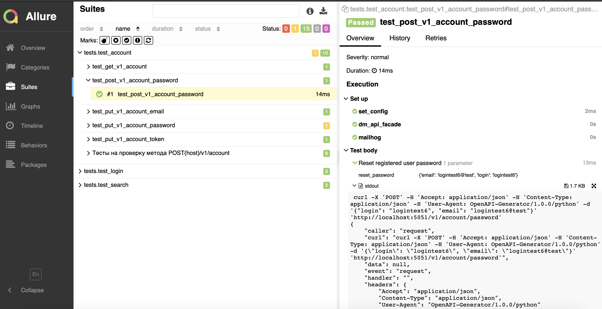

# Проект для тестирования сервиса "dm_api_account"


### Ответственные лица:

* Меньшиков Валерий:
  * telegram: [Valeriy Menshikov](https://t.me/valeriy_menshikov)

  

### Тестируемый сервис:
**dm_api_account**
* Swagger: [swagger](http://5.63.153.31:5051/)


### Установка и запуск
```shell
 git clone https://github.com/ValeriyMenshikov/dm_api_tests
 cd dm_api_tests
 pip install -r requirements.txt
```

### Различия в ветках фреймворка
В ветке main - фреймворк, который включает в себя все вспомогательные библиотеки.  
В ветке client - фреймворк, из которого вынесены вспомогательные библиотеки.  
В ветке client_gen - фреймворк, где клиент account и login сгенерированы, а так же сгенерирован клиент из gRPC модели.  

### Используемые технологии
<p  align="center">
  <code></code>
  <code></code>
  <code></code>
  <code></code>
  <code></code>
  <code></code>
  <code></code>
  <code></code>
  <code></code>
  <code></code>
</p>

### Архитектура проекта

```
 ├── configs                     # Папка со всей конфигурацией проекта
 │   ├── prod.yml                # Настройки для прода
 │   └── stg.yml                 # Настройки для тестовой среды
 ├── data                        # Папка для констант и статических тестовых данных
 │   └── post_v1_account.py      # Файл где должны храняться константы для метода создания аккаунта
 ├── generic                     # Папка с базовыми специфичными для проекта проверочными и вспомогательными классами и функциями
 │   ├── helpers                 # Папка для вспомогательного функционала общего назначения 
 │   │   ├── account.py          # Помощник для работы с account_api
 │   │   ├── dm_db.py            # Помощник для работы с базой данных
 │   │   ├── login.py            # Помощник для работы с login_api
 │   │   ├── mailhog.py          # Помощник для работы с почтовым сервером
 │   │   ├── search.py           # Помощник для работы с gRPC сервисом
 │   │   ├── orm_models.py       # ORM модели для работы с базой данных
 │   │   └── orm_db.py           # Помощник для работы с базой данных используя ORM
 │   ├── assertions              # Папка для проверок
 │   │   └── post_v1_account.py  # Файл содержит assert-ы для метода post_v1_account
 ├── services                    # Папка в которой хранятся фасады для работы с API
 │   └── dm_api_account          # Фасад который объединяет API и классы помощники
 ├── tests                       # Папка для хранения тестов
 │   ├── test_account            # Папка с тестами для account_api
 │   ├── test_login              # Папка с тестами для login_api
 │   └── test_search             # Папка с тестами для search gRPC API
 ├── .gitignore                  # Стандартный файл для игнорирования нежелательных файлов для загрузки в репозиторий
 ├── conftest.py                 # Файл с инициализацией настроек и фикстур
 ├── requirements.txt            # Файл с зависимостями
 └── README.md                   # Файл с описанием репозитория для тестов
```
### В файле config настраиваются окружения и выносятся основные подключения.



###  Allure report
##### После прохождения тестов, результаты можно посмотреть в генерируемом Allure отчете.


##### Во вкладке Graphs можно посмотреть графики о прохождении тестов, по их приоритезации, по времени прохождения и др.


##### Во вкладке Suites находятся собранные тест кейсы, у которых описаны шаги и добавлены логи.



